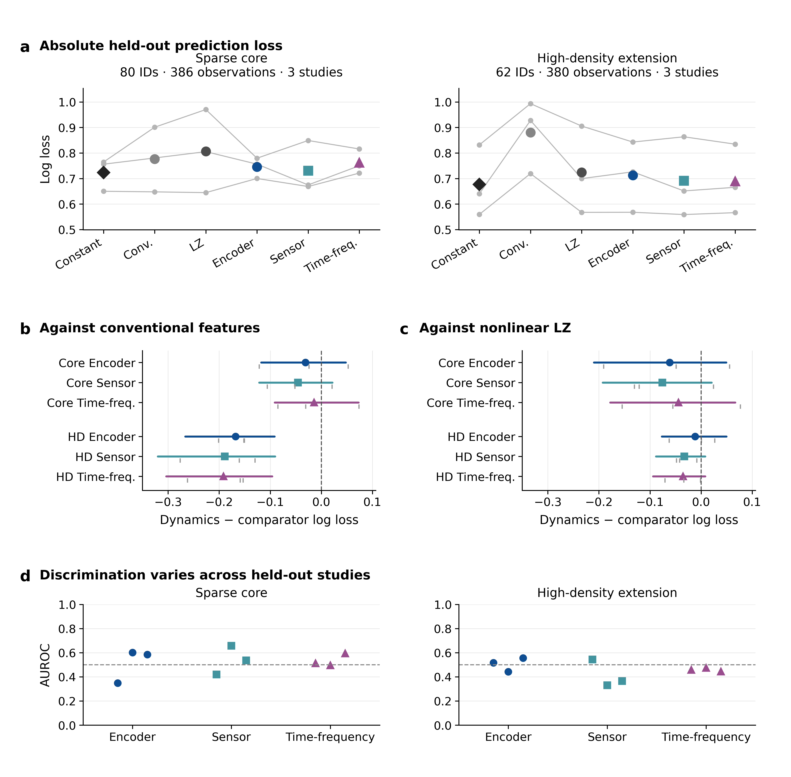
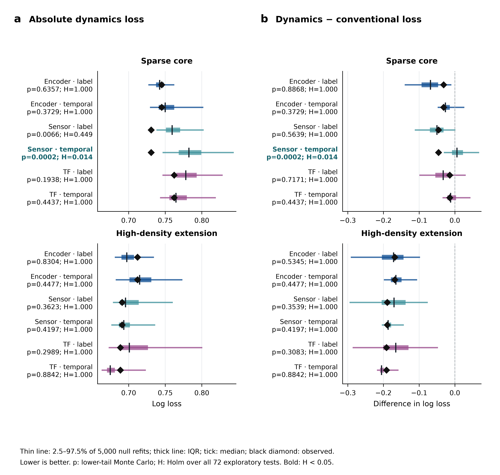
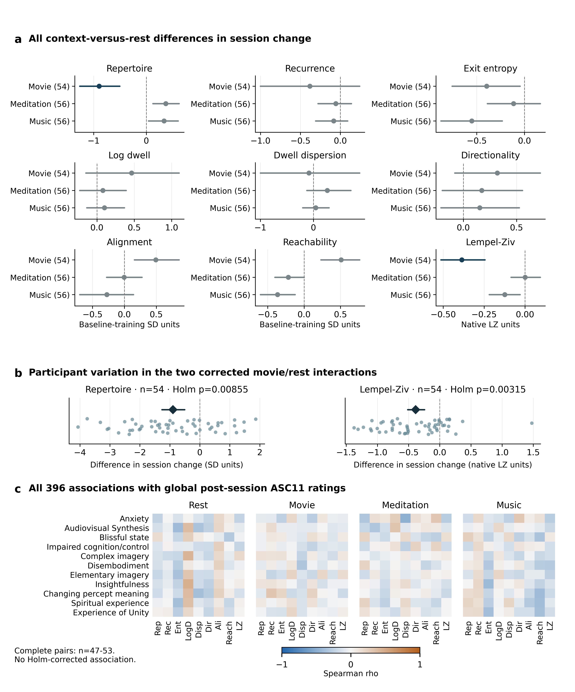
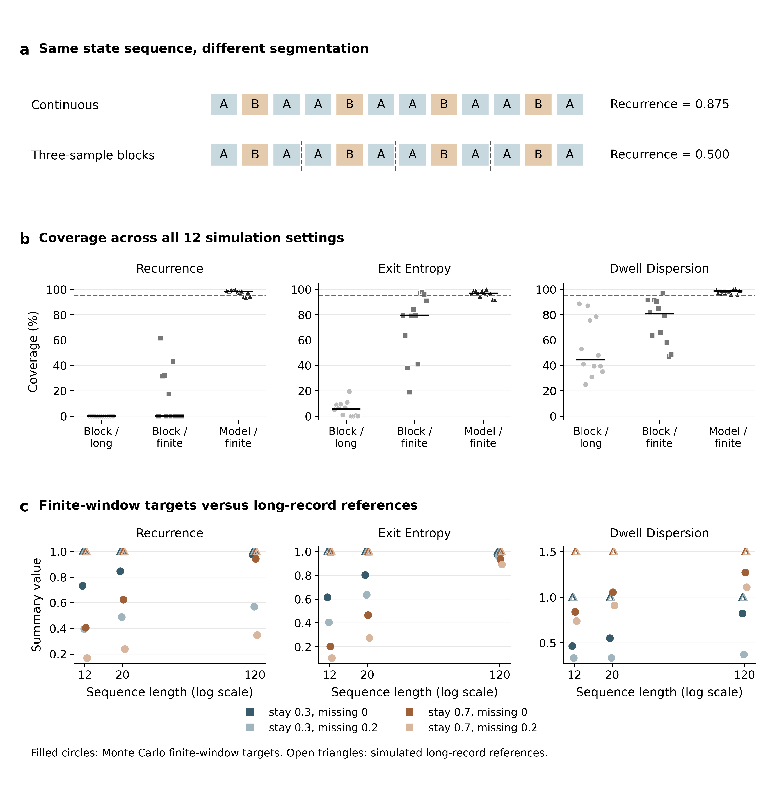

# Separating predictive performance from temporal specificity in EEG markers of experience

Authors: [AUTHOR NAMES AND ORDER]

Affiliations: [DEPARTMENT, INSTITUTION, CITY, STATE OR REGION, COUNTRY FOR EACH AUTHOR]

Correspondence: [NAME, POSTAL ADDRESS AND EMAIL]

Article type: Research Article

Keywords: consciousness; EEG; dreaming; neural dynamics; cross-study prediction; measurement calibration

## Abstract

Temporal organization of brain activity is a candidate marker of conscious experience, but predictive improvement, temporal specificity and measurement reliability are distinct properties. We examined these properties in an exploratory, non-preregistered reanalysis of open electroencephalographic datasets. Nested study-held-out models compared eight trajectory descriptors with conventional features and a nonlinear complexity comparator. A sparse sleep portfolio included 80 participant identifiers and 386 observations; an overlapping higher-density extension included 62 identifiers and 380 observations, each across three study groups. In the extension, trajectory models improved log loss relative to conventional features by 0.168–0.191, but their advantages over the nonlinear comparator were uncertain. A training-only constant predictor had lower mean loss than all trajectory models in both portfolios. After 5,000 nested refits per null distribution, four correlated sparse-sensor temporal-control comparisons survived Holm correction across 72 tests (adjusted p = 0.0144); no high-density comparison did. In a separate psilocybin cohort, movie-versus-rest differences in session change survived multiplicity correction for repertoire and complexity, but none of 396 associations with global subjective ratings did. Simulations showed that segmenting observation history changes recurrence and can invalidate short-block intervals; calibration improved when the finite-window target and known generative model were explicitly matched. These findings identify a limited temporal-specificity signal without establishing a transferable or clinically useful experience marker. They support evaluating absolute prediction, comparator dependence, temporal controls and finite-observation measurement as separate requirements.

## Introduction

Neural dynamics offer a natural vocabulary for studying consciousness. A brain that remains within a narrow set of activity patterns differs from one that explores many patterns; persistence, transitions and coordination may carry information that is absent from a time average. The empirical challenge is to establish what a particular dynamical measurement tells us about experience, rather than merely whether it changes between experimental conditions. Sleep studies provide an especially useful distinction between the physiological state of the organism and its reported experience. Reports following awakenings can identify experienced content, an impression of experience without recall, or no reported experience within the same sleep stage [1,3]. These categories are nevertheless retrospective reports, not direct observations of the presence or absence of consciousness.

Several findings motivate examining both conventional and trajectory-based descriptions of EEG. Spontaneous signal complexity decreases during propofol-induced general anaesthesia [2], and sleep EEG features can distinguish subsequent experience reports [1,3]. Pretrained EEG encoders also make it possible to construct representations without fitting a new feature extractor to a small consciousness dataset [4]. However, an encoder's usefulness as a representation does not establish that its trajectories recover a conserved mechanism of experience. A classifier can improve relative to a poorly performing benchmark, exploit non-temporal properties of a representation, or generalize across observations without generalizing across independent studies. Each possibility requires a different comparison.

Context introduces a further distinction. PsiConnect provides EEG and functional imaging before and on a psilocybin session, during rest, meditation, music and movie viewing [5]. Analyses of this cohort have already demonstrated context-aligned dynamics and associations with subjective experience using other representations and measures [6]. A complementary reanalysis can ask whether simpler, explicitly defined trajectory descriptors show context-dependent session changes and whether these changes map onto the released subjective subscales. It cannot independently replicate the cohort or assume that all representations and subjective endpoints measure the same construct.

Measurement itself may limit interpretation. Recurrence depends on what counts as a previous visit, dwell statistics depend on observation boundaries, and entropy estimates depend on the number of observed transitions. Short windows and rejected samples can therefore change both the estimated value and the quantity an interval is intended to cover. An apparently precise dynamical feature may still be an unreliable estimate of a longer-record property. Conversely, failure to recover a long-record reference need not imply that a finite-window summary is meaningless.

Here we examine four separable questions: whether trajectory descriptors improve prediction of experience reports across studies; whether apparent improvements depend on labels and temporal organization; whether the descriptors capture context-associated changes and subjective variation; and whether their uncertainty estimates respect the available observation history (Figure 1). We use open datasets and preserve distinctions among sleep experience reports, psychedelic phenomenology, sensory reports and stimulation responses. The study is exploratory and was not preregistered. Its contribution is a joint empirical assessment of these inferential links, rather than a confirmatory test of a universal consciousness manifold.

## Methods and Materials

### Study scope and analysis provenance

We conducted secondary analyses of publicly accessible human EEG datasets and computational simulations. No participants were recruited and no new intervention was administered for this work. Dataset eligibility was based on accessible signals, documented outcome semantics, usable timing, channel availability and verifiable source files. The main sleep contrast was confined to stage N2. Analyses were not selected by a requirement that an earlier result reach statistical significance. Alternative report contrasts, representation controls and measurement diagnostics were retained in the analysis inventory, including analyses that could not be estimated.

The completed analyses were subsequently reviewed to establish a manuscript-level evidence synthesis. The training-only constant predictor, study-level precision sensitivity, common-family multiplicity audit, complete subjective-subscale screen and finite-window calibration diagnosis belong to this post-results review. This chronology is important: neither the manuscript's organization nor these additional checks constitute preregistration or prospective confirmation. Exploratory results are reported with their full comparison families rather than retrospectively relabelled as primary confirmatory hypotheses.

Source releases, intermediate arrays and analysis outputs were linked through SHA-256 checksums. The figure renderer verified reviewed artifacts against their recorded hashes and used the original result files. Figures were drawn without refitting models or changing the numerical results. Supplementary Data contain aggregate estimates, original intervals, null-refit statistics, the analysis inventory and simulation settings. Participant-level EEG and questionnaire records were not included in that supplement. Code and configuration identify the executed estimators and processing policies.

### Sleep datasets and report definitions

Sleep data were obtained from the DREAM resources [3,14], including the versioned Tononi serial-awakening release [16]. In the sparse core, the estimable study groups were Oslo, Turku and Wisconsin. Oslo evening and morning recordings were held out together because possible within-laboratory participant aliases were unresolved. Counts therefore refer to participant identifiers rather than a verified count of unique people across those source collections. The core analysis contained 80 identifiers and 386 eligible N2 observations. Reports of experience with recall were contrasted with explicit reports of no experience; experience without recall was reserved for separate sensitivity analyses. A numerical category alone was insufficient for admission when the source description did not establish its meaning.

The higher-density extension contained 62 identifiers and 380 N2 observations from Oslo, Turku and Rome Sapienza. It reused eligible Oslo and Turku material and added Rome's binary experience reports. Rome did not collect dream contents in a way that establishes recalled content for the positive category; ambiguous reports were excluded. All nonempty source quality remarks in that extension were conservatively excluded. Thus the extension tests transfer of reported experience under a related but non-identical assay. It is not an independent replication of the core, and the participant counts must not be summed. Because channel availability, study composition and report semantics all differ, comparison of the two portfolios is not a controlled test of electrode density.

The sparse montage used Fp1, C3 and O1. The extension used fourteen channels: Fp1, Fp2, F3, F4, F7, F8, C3, C4, Cz, P3, P4, Pz, O1 and O2. Wisconsin's sparse positions were mapped to observed HydroCel sensors with documented spatial discrepancies of approximately 1.0–1.3 cm; no channel interpolation was performed. Native named channels were used elsewhere, with the source-supported Rome label alias 01 interpreted as O1. Exact-electrode and alternative-stage analyses were retained as sensitivities when enough independent study groups remained.

### Preprocessing and representations

For sleep analyses, the final twenty seconds before the documented awakening boundary were extracted. Documented constant EDF padding was removed under an explicit suffix rule; recordings with an excessive terminal flat run were excluded. Signals were referenced to the average of the selected observed channels, band-pass filtered from 0.5 to 30 Hz using a fourth-order zero-phase Butterworth filter, and resampled to 200 Hz. Finite stretches were filtered separately, and windows adjacent to internal gaps were rejected. This offline procedure does not support prospective latency claims.

Non-overlapping one-second windows were rejected for nonfinite values, peak-to-peak amplitude above 500 microvolts in any selected channel, or channel standard deviation below 0.01 microvolts. At least ten clean seconds were required. Retained windows were assigned contiguous-segment identifiers; missing intervals were not joined into artificial transitions. Voltage units had to be documented for the sleep encoder input. Quality rules did not use experience labels, although cohort definitions necessarily used source report information.

Three representations were analysed separately. The sensor representation comprised channel-wise log root-mean-square amplitude per second. The time–frequency representation comprised channel-wise log Welch power in delta (0.5–4 Hz), theta (4–8 Hz), alpha (8–13 Hz) and beta (13–30 Hz) bands, using one-second segments and half-open band boundaries. The frozen-encoder representation used the LaBraM base model with 200-sample patches and input converted to microvolts [4]. Its weights were not fine-tuned to experience labels. The model implementation was pinned to revision c431221e6cfd23dbfa9950e0180682fb322b0548. Overlap between upstream pretraining data and the present cohorts could not be fully excluded; encoder transfer is therefore not described as transfer to definitively unseen pretraining populations.

### Trajectory descriptors and conventional comparators

An eight-feature trajectory profile comprised repertoire, log median dwell time, dwell dispersion, recurrence, exit entropy, directionality, alignment and reachability. Within each training partition, weighted covariance principal components reduced trajectories to two dimensions and were scaled by their training eigenvalues. A three-state k-means dictionary was then fitted with ten initializations. Training weights balanced studies and participant identifiers, and were distributed across the available time points of each observation. The same fitted mapping was applied to its validation or held-out observations.

Repertoire was the participation ratio of the shrinkage covariance eigenvalues in the input representation. Dwell runs ended at changes of state or segment boundaries. Log dwell was the natural logarithm of the median run duration; dwell dispersion was the interquartile range divided by the median. Recurrence was the fraction of eligible subsequent runs returning to a state already visited within the same segment, with the first run of each segment excluded from the denominator. Exit entropy summarized the normalized diversity of destination states at exits, weighted by observed exit counts. These are descriptive persistence and revisitation measurements, not a score defined to peak during waking consciousness.

Directionality was a transition-based entropy-production estimate. Alignment used rank-one, two-fold cross-validated ridge prediction between regional representations, preserving segment boundaries. Sensor and time–frequency coordinates were treated as separate modules; encoder regional states used the available model-defined grouping. Reachability was a regularized local-linear proxy in the reduced space, weighted by state occupancy. It is not an intervention-based measure of physical controllability. Estimator failures and nonfinite measurements were recorded as unavailable, rather than assigned favourable values. Feature definitions and their computational regularization are specified in the accompanying implementation.

Conventional features were computed within each contiguous one-second signal window and averaged within an observation: relative delta, theta, alpha and beta power, the 2–30 Hz spectral exponent, normalized Lempel–Ziv complexity, permutation entropy and log root-mean-square amplitude. The conventional multivariate comparator used these eight features. A spectral comparator used the four relative powers and exponent. A nonlinear scalar comparator used Lempel–Ziv complexity expanded to polynomial degree three. The latter distinguishes improvement over a simple linear multivariate benchmark from improvement over a flexible model of a single complexity measure.

### Nested prediction and uncertainty

The outer evaluation left one independent study group out. Hyperparameters were selected using group-held-out validation within the remaining studies; with three study groups overall, this entails two inner training/validation splits. Every data-fitted trajectory transform was re-estimated within each inner and outer training partition. Feature imputation, standardization and classifier fitting were likewise confined to training data. Entirely unmeasured training features were dropped, and invalid candidates were recorded. Unresolved Oslo aliases precluded a claim of independent participant-held-out transfer within that collection.

Models used L2-regularized logistic regression. For the trajectory profile, the grid crossed inverse regularization strengths 0.1, 1 and 10 with profile principal-component dimensions 1–5. Comparator grids contained fifteen log-spaced strengths between 0.1 and 10, giving the same requested number of tuning evaluations. The nonlinear scalar model applied its polynomial expansion after scaling. The revised prediction implementation used training-mean imputation. Equal participant weight within study and equal study weight were used in classifier fitting and evaluation; unsupervised feature preprocessing in the classifier pipeline was fitted on training rows.

Log loss was the principal comparison statistic. Within each study, observation-level losses were first averaged within participant identifier and then across identifiers; study means were averaged with equal weight. Paired differences were trajectory-model loss minus comparator loss, so negative values favour the trajectory model. Area under the receiver-operating-characteristic curve, Brier score and average precision supplied complementary diagnostics. The post-results constant predictor assigned each held-out study the mean experience rate estimated from the other studies, with the same participant/study balancing. Held-out labels did not determine its probability. Its comparison was descriptive; no new paired interval was calculated.

Original 95% intervals used 1,000 hierarchical bootstrap draws, resampling study groups and participant-level mean paired losses within the sampled studies. These intervals condition on the already fitted held-out predictions: model selection and fitting were not repeated inside that bootstrap. A subsequent precision sensitivity used the three study-mean differences and a t multiplier with two degrees of freedom, alongside leave-one-study-out mean contrasts. Since outer folds share training data and only three studies are represented, neither procedure is a calibrated population-generalization interval. We did not calculate retrospective observed power, infer equivalence from an interval crossing zero, or define a data-derived minimum effect of interest.

### Label and representation controls

For each portfolio and representation, 100 seeded replicates were initially computed for each of three controls. After inspection of those results revealed that 100 draws could not resolve a rejection across the 72-test family, a fixed continuation to 5,000 replicates per null distribution was selected and completed for every family, without changing the observed analyses. This extension was chosen after seeing results and is not prospective confirmation. Label permutation shuffled experience labels within study, participant identifier and sleep stage. Temporal permutation shuffled the order of representation samples within each intact segment, with a common ordering across the trajectory and its regional arrays. Representation-phase controls independently randomized Fourier phases within segments while preserving the corresponding representation spectra. They do not preserve all properties of the original EEG signal and are not original-signal spectral controls. Each replicate repeated the nested prediction pipeline.

Observed statistics were compared with their matched null-refit statistics using lower-tail Monte Carlo values, p = (1 + number of null statistics no greater than observed)/5,001, because lower loss or a more negative paired difference is better [8]. Absolute trajectory loss and differences against the conventional, nonlinear-scalar and spectral comparators were examined. The audit family contained 72 comparisons across portfolios, representations, controls and statistics. We report both raw tails and Holm-adjusted values [9].

The final minimum attainable raw p is 1/5,001, below the first Holm threshold of 0.05/72. Null refits reduce Monte Carlo resolution error but do not add independent participants or studies. Four related metrics from the same sparse sensor representation and temporal control passed the full-family adjustment; they should not be interpreted as four independent replications. Label exchangeability is an assumption, and only 49 of 80 core identifiers and 29 of 62 extension identifiers had both observed categories and hence permutable labels.

### Context and subjective experience analyses

PsiConnect EEG was accessed from the public release ds006110, version 1.2.1 [5,15]. We used the released cleaned FieldTrip files, separately for baseline and psilocybin sessions and for rest, meditation, music and movie contexts. Fourteen observed channels matched the extension montage. Each file contributed up to the first 120 accepted one-second windows, with at least ten required. Time discontinuities and rejected windows defined segment boundaries. Following observed-channel average referencing, 0.5–30 Hz filtering and 200 Hz resampling, flat or nonfinite windows and windows with an absolute-amplitude/global-RMS ratio above 30 were excluded. Unverified absolute voltage units were removed by dividing the accepted windows by their global RMS. This branch therefore analysed amplitude-normalized sensor trajectories, not unverified inputs to the frozen encoder.

For each held-out participant, the trajectory dictionary was fitted using baseline recordings from all other participants. Eight trajectory features were standardized by those training baseline means and standard deviations; Lempel–Ziv complexity remained in native units. We calculated each participant's session difference within context, then the difference between that change and the change at rest. Complete paired participants contributed to each contrast. Original descriptive intervals used 1,000 participant-bootstrap draws, holding feature construction fixed.

The subsequent boundary audit examined all 36 session changes and 27 context-versus-rest interactions with 19,999 participant sign-flip draws and two-sided plus-one tails. Holm correction covered all 63 tests. Sign flips assume symmetric participant differences under the null; shared cross-fitted normalization was not refitted during testing. Fixed task order, eyes-open movie versus eyes-closed rest and the absence of placebo preclude isolating a causal effect of context or drug from these contrasts.

All eleven official, non-imputed ASC11 subscales were read from the released session-02 phenotype files at repository revision 8c5d6b077c63d29796409b622ebc300fdec6aadd [7,15]. Participant identifiers were matched exactly after removal of an optional prefix; joins were never based on row order. For each of four contexts and nine features, individual session changes were correlated with each subscale using Spearman's rho, giving 396 comparisons. Missing scores were not imputed. Complete-pair sample sizes ranged from 47 to 53. Asymptotic rank-correlation p-values were Holm-adjusted across all 396 tests; 999 participant-pair bootstrap draws supplied descriptive intervals. These ratings describe global post-session experience and were not treated as simultaneous, context-specific reports.

### Measurement simulations

A separate diagnostic evaluated recurrence, exit entropy and dwell dispersion under a known, stationary three-state Markov process. Initial states were uniform; the process remained in the current state with probability 0.3 or 0.7 and otherwise selected either alternative with equal probability. Sequence lengths were 12, 20 or 120, with independent missing fractions of 0 or 0.2, yielding twelve settings. Deleted observations created gaps and did not create transitions. This is a simulation of estimator behaviour, not synthetic biological evidence for consciousness.

For each setting, the finite-window target was the mean statistic in 1,000 independently simulated sequences with the same length and missingness. An independent set of 1,000 sequences estimated the distribution of estimation errors around that target. Model-based 95% intervals were evaluated using these error quantiles and 200 independent test sequences. A 10,000-state continuous realization supplied a separate long-record reference. Reference and target values are Monte Carlo estimates, not exact population parameters.

For each test sequence, the original short-block procedure generated 99 length-matched resamples from blocks of three observed samples. Resampled discontinuities and original gaps were preserved as segment boundaries. Coverage was assessed separately against the finite-window target and long-record reference. Thus poor coverage could be partitioned conceptually into resampling problems and mismatch of the inferential target. Cell-level coverage proportions and exact binomial intervals are supplied for every setting. The known-model calibration assumes the correct transition and missingness model; it is not a validated correction for biological EEG or for all eight trajectory features. Prediction-level bootstrapping and these within-trajectory intervals are different procedures.

### Secondary perturbation and sensory-report checks

Additional open-data analyses evaluated whether the trajectory interpretation was supported outside sleep and psychedelic contexts. In the propofol/TMS dataset ds005620, version 1.0.0 [10], spontaneous EEG and stimulation recordings were paired by exact participant, session, run and task entities rather than proximity in a file list. Sensor trajectory features from available passive intervals were added to conventional features and a sedation indicator. Nested participant-held-out ridge regression selected regularization from 0.1, 1 and 10. Outcomes were sensor-spread fraction, response differentiation (the covariance participation ratio of the averaged response between 20 and 300 ms), and the last post-20-ms crossing of a baseline-derived global-field-power threshold. Right-censored recovery records were excluded from recovery prediction. Paired squared-error differences were averaged within participant and bootstrapped conditionally on fitted predictions. These outcomes are stimulation-response proxies, not direct tests of the estimated reachability construct.

Near-threshold tactile data (ds001785, version 1.1.1 [11]) and the open somatosensory report-task dataset [12,13] were analysed using a separate subsecond sensor track, not one-second encoder trajectories. Features were baseline-normalized RMS, spatial participation of mean sensor responses and temporal roughness, in intervals of −200–0, 20–80, 80–200, 200–400 and 400–600 ms relative to stimulation. A causal fourth-order 40 Hz low-pass filter was applied; upstream preprocessing can still limit prospective timing claims. Conditions were matched on physical intensity within participant before averaging. Participant sign flips and bootstrap intervals summarized contrasts. Missing responses were retained as missing, and tactile pre-response analyses required the full interval to end before the recorded response. A checksum-valid but internally incomplete EEG recording was excluded as a whole. Report/no-report ordering and unverified equivalence of experience were retained as interpretive limitations. Aggregate results for these secondary checks and unavailable analyses accompany the main figures in Supplementary Data.

## Results

### Improvements over conventional features did not establish useful cross-study decoding

We first asked whether an eight-feature trajectory profile predicted subsequent experience reports more accurately than conventional EEG summaries in independent held-out studies (Figure 2). In the sparse core, trajectory-minus-conventional log-loss differences were −0.0311 for the frozen encoder (95% conditional bootstrap interval −0.1176 to 0.0475), −0.0456 for sensor trajectories (−0.1216 to 0.0214), and −0.0141 for time–frequency trajectories (−0.0914 to 0.0728). All intervals included zero. Thus the strict sparse contrast did not resolve an advantage for the tested trajectory profiles.

The higher-density extension gave larger improvements over the conventional multivariate model: −0.1679 (−0.2662 to −0.0916), −0.1890 (−0.3202 to −0.0904), and −0.1914 (−0.3037 to −0.0962), respectively. However, the corresponding advantages over the nonlinear Lempel–Ziv comparator were only −0.0119, −0.0330 and −0.0354, with all intervals including zero. The observed ranking was therefore comparator-dependent, rather than evidence that a multidimensional trajectory profile captured information unavailable to a nonlinear scalar model.

Absolute prediction further qualified the ranking. The training-only constant predictor had equal-study mean losses of 0.7235 in the core and 0.6770 in the extension, below all three trajectory models in the respective portfolios. Trajectory-model losses were 0.7453, 0.7308 and 0.7623 in the core, and 0.7122, 0.6911 and 0.6887 in the extension. These are descriptive comparisons, not significance tests of inferiority. Extension discrimination was also weak and heterogeneous: held-out-study areas under the receiver-operating-characteristic curve ranged approximately from 0.331 to 0.556. Improvement relative to the conventional model therefore did not demonstrate useful individual discrimination or a clinically applicable marker.

Precision remained limited by the number of studies. The study-level t sensitivities for core conventional comparisons were −0.2477 to 0.1855, −0.2037 to 0.1124 and −0.2146 to 0.1864. In the extension they were −0.2400 to −0.0958, −0.3807 to 0.0028 and −0.3437 to −0.0391. These conditional sensitivities preserve some relative gains but expose their dependence on a small set of study means. They do not supply fully refitted generalization uncertainty.

### Null controls separated relative model ranking from temporal information

The extension's improvements against conventional features were not unusual under matched label or temporal controls (Figure 3). For encoder, sensor and time–frequency representations, respectively, raw lower-tail values were 0.5345, 0.3539 and 0.3083 under label permutation, and 0.4477, 0.4197 and 0.8842 under temporal permutation. Across all 36 high-density tests, none had a raw p below 0.05; the smallest was 0.1360 and every Holm-adjusted p was 1. These null-distribution positions show that the relative conventional-model advantage alone does not identify a label-dependent, temporally specific contribution in this pipeline. They do not establish equivalence between observed and permuted data.

A more favourable, but limited, signal appeared in the sparse sensor analysis. Its absolute prediction loss was below all 5,000 temporal-null statistics (raw p = 0.00020; Holm p = 0.0144). Its temporal-control differences against conventional multivariate, nonlinear-scalar and spectral comparators had the same lower-tail and adjusted values. These four metrics derive from the same representation and control, not four independent demonstrations. Under label permutation, absolute loss had raw p = 0.00660 but did not survive the full-family adjustment (Holm p = 0.4487); the conventional-comparator difference was unexceptional (raw p = 0.5639). The phase-randomized sensor absolute-loss control was also not significant (raw p = 0.0712). Absolute loss and relative improvement therefore answered different questions even within the same representation.

Four of the 36 sparse-core tests, all sensor temporal-permutation comparisons, survived the 72-comparison Holm audit; five sparse-core tests had raw p below 0.05. This corrected but post-results-extended finding supports temporal specificity for the tested sparse sensor descriptor pipeline and report contrast, not a conserved mechanism of consciousness. The higher-density portfolio did not reproduce a corrected finding, although its overlapping cohorts and different report assay preclude a simple independent-replication interpretation. The complete 72-test review and all 5,000 refit statistics per test are retained in Supplementary Data.

### Context-associated changes were more evident than subjective specificity

We next examined whether the same descriptor family captured context-associated session changes in PsiConnect (Figure 4). Across all 63 boundary tests, eleven survived the participant sign-flip/Holm analysis, including two context-versus-rest interactions. Relative to rest, movie viewing showed a more negative session change in repertoire (mean difference −0.8958 baseline-training standard-deviation units; descriptive 95% bootstrap interval −1.2634 to −0.5049; 54 paired participants; adjusted p = 0.00855) and in Lempel–Ziv complexity (−0.3861 native units; −0.5139 to −0.2445; 54 participants; adjusted p = 0.00315).

The full set of 27 interactions is displayed rather than only these two result-selected examples. Several other descriptive intervals excluded zero, but their contrasts did not survive the complete 63-test adjustment. This illustrates why an individual interval and a multiplicity-adjusted decision should not be treated interchangeably. The corrected interactions establish sensitivity to the session-by-context contrast in this cohort, but fixed order and eye-state differences prevent an isolated causal interpretation.

Subjective mapping was less resolved. None of the 396 correlations between context-specific EEG session changes and eleven global post-session subscales survived Holm correction. The smallest raw p was approximately 0.000500, corresponding to an adjusted value of 0.1981. The complete heatmaps include every scale-feature-context combination, with 47–53 complete pairs per association. These findings do not exclude experience-related neural variation; they show that the tested descriptors and globally timed ratings did not provide corrected evidence of the specified mappings. Because the cohort has already been analysed for context-aligned dynamics [6], this result is a complementary operational comparison, not independent replication or refutation of that work.

### Observation boundaries changed both recurrence and interval coverage

The measurement diagnostic identified a concrete reason to separate a dynamical summary from an invariant property of the underlying process (Figure 5). For an illustrative repeated A–B–A sequence, the same estimator gave recurrence 0.875 when the sequence was continuous but 0.500 when it was divided into three-sample segments. No observation values changed. Segment boundaries changed which previous visits were available to the estimator.

Across the twelve Markov settings, median short-block interval coverage of the long-record reference was 0% for recurrence, 5.75% for exit entropy and 44.5% for dwell dispersion. Changing the target to the finite-window expectation improved median coverage to 0%, 79.5% and 80.75%, respectively. Thus target mismatch explained part, but not all, of the failure: recurrence remained poorly covered even for its finite-window target.

Independent calibration under the known finite-window model yielded median coverage of 98.25%, 96.75% and 98.5%, with setting-specific ranges of 93.5–99.5%, 91.5–100% and 95.5–100%. Discrete statistics can produce conservative coverage, and targets were themselves estimated by Monte Carlo. These results establish a model-dependent calibration example and a failure of the tested short-block procedure, not biological validation. The broader recovery inventory also retained unavailable reachability settings rather than interpreting them as successful recovery.

### Secondary analyses did not establish a conserved experience-specific signature

Perturbation-response prediction remained uncertain. Adding spontaneous dynamics to condition and conventional predictors changed held-out squared error by −0.02936 for differentiation (95% conditional interval −0.14888 to 0.07557; 14 participants), −0.00221 for recovery (−0.12901 to 0.12787; 13 participants), and 0.0000251 for sensor spread (−0.0000828 to 0.0001219; 14 participants). Only two or three participants, depending on outcome, supplied paired awake/sedation changes, limiting within-person interpretation.

The tactile analysis retained seventeen complete recordings after the incomplete-file exclusion. No contrasts survived Holm correction among the thirty main comparisons or the thirty pre-response comparisons; confidence-association intervals included zero. In the separate report-task analysis, three of fifteen available task-relevance comparisons survived its Holm family in twenty-nine participants. Task relevance is not identical to conscious experience, and report ordering prevents a clean report-specific causal inference. Sensitivity analyses of alternative sleep report categories and omitted feature families also yielded mixed findings or became unavailable when too few studies remained. These checks constrain a conserved-signature interpretation rather than providing a basis for selecting only favourable modalities or report contrasts.

## Discussion

This exploratory reanalysis separates four properties that can otherwise be conflated when evaluating neural dynamics as a marker of experience. A model may outperform a conventional benchmark without outperforming a nonlinear scalar comparator or a training-only constant. A relative advantage may persist when labels or temporal order are disrupted. A neural feature may be sensitive to session and context without showing a resolved mapping to subjective subscales. Finally, the apparent uncertainty of a dynamical summary may depend on whether its observation history and inferential target are respected. The present data exhibit all four distinctions.

### Comparator dependence is scientifically informative

The higher-density extension produced a reproducible numerical ranking within the completed analysis: trajectory models had lower held-out log loss than the conventional multivariate comparator. That ranking is a result, but its interpretation is narrower than successful experience decoding. Weak discrimination, uncertain gains over nonlinear Lempel–Ziv complexity and lower loss for a constant reference show that the conventional comparison alone is insufficient. Differences in regularization, calibration and sensitivity to between-study shifts can affect log loss without improving the ordering of experienced versus no-experience observations. We did not directly identify which of these mechanisms explains the ranking, and a claim that the conventional model was specifically overconfident would require additional calibration analysis.

The disagreement between absolute and relative null results is similarly informative. In the sparse sensor analysis, observed absolute prediction loss was unusual under the temporal refits after full-family correction, yet its relative conventional-model improvement was ordinary under label permutation. This pattern prevents collapsing all controls into one conclusion. The corrected temporal finding makes sparse sensor information a specific target for independent validation, but does not validate a universal temporal mechanism or establish useful absolute prediction. Conversely, the extension's unexceptional raw null-distribution positions give a concrete reason not to equate a benchmark gain with temporal specificity.

### Context sensitivity is not the same as a subjective marker

The movie-versus-rest interactions provide the clearest multiplicity-adjusted empirical associations in the present analysis. Their joint appearance in repertoire and conventional complexity argues that the measured session changes depend on what participants were doing and observing. A single global label for the psychedelic session therefore does not exhaust the structure in these EEG summaries. At the same time, the contrast combines context, visual input, eye state and position in a fixed sequence, so it cannot isolate which component is responsible.

These results should be situated beside, not substituted for, the published PsiConnect analyses [6]. That work examined context-aligned organization using different representations and linked it to particular experiential constructs. We evaluated amplitude-normalized sensor descriptors, paired changes relative to rest and a complete screen of the released non-imputed ASC11 subscales. Our null-corrected subjective screen is not a direct test of the same neural metric, subjective construct or inferential procedure. The useful comparison concerns the specificity of operational definitions: a descriptor that responds to context need not be a sensitive summary of globally recalled phenomenology. More closely timed ratings and an independent cohort would better connect those levels of measurement.

### Finite observation is part of the dynamical construct

The simulation identifies an estimator-level problem with implications beyond the present datasets. Recurrence, as implemented here, is explicitly history-dependent. Resetting a path at missing intervals or bootstrap boundaries removes opportunities to revisit an earlier state. Treating the resulting statistic as an estimate of a duration-invariant process property can therefore be misleading. The A–B–A example makes this change transparent without requiring a biological explanation or a complex neural model.

Length-matched targets improved coverage for exit entropy and dwell dispersion, but did not repair the tested recurrence bootstrap. Calibration under a known process performed substantially better, showing that poor block coverage is not an unavoidable property of all uncertainty estimation for these summaries. However, this example uses the true transition and missingness model. Transferring it to EEG would require validation of those assumptions or a separately justified resampling method. These simulations consequently strengthen the measurement argument while leaving biological calibration open.

### Scope and limitations

The principal generalization limit is the number and heterogeneity of independent studies. Hundreds of observations and numerous algorithmic refits do not replace three study groups. Cohort overlap, unresolved aliases, approximate sparse electrode correspondences, non-identical experience reports and unknown encoder-pretraining overlap further restrict transfer claims. The higher-density extension is informative about an additional analysis portfolio, but cannot isolate the effect of adding electrodes. Feature availability and short usable records also limit the dynamical models that can be estimated.

Uncertainty has several distinct limitations. Prediction intervals condition on fitted models; the study-level sensitivity does not remove shared-training dependence. Context and subjective resampling condition on cross-fitted features and normalization. The 5,000-refit continuation resolves the original Monte Carlo resolution limit, but its count was chosen after inspection of the 100-refit results; neither the corrected p-values nor four correlated rejections turn this into a preregistered confirmatory analysis. An independent study with prespecified comparisons would be needed to assess transportability. Exploratory status permits hypothesis generation, not selective omission of controls or retrospective certainty.

The secondary branches also have narrower constructs than a conserved consciousness regime. TMS outcomes are sensor-level response proxies with small paired samples and no sham control. Tactile analyses measure sensory reports and confidence under their task conditions; the report-task contrasts include attention, task relevance and ordering. The completed analysis therefore does not support a unified clinical biomarker, causal neural controllability or a general claim that informative temporal organization is absent. It provides empirically grounded boundaries for those interpretations and identifies the comparisons that future validation must resolve.

## Conclusions

In these open EEG datasets, a corrected temporal-control finding in the sparse sensor pipeline did not converge with high-density transfer, absolute predictive utility, subjective mapping and measurement calibration into a single validated marker of experience. The positive contribution is a set of empirically demonstrated distinctions: a narrow temporal-specificity signal can coexist with weak absolute prediction, benchmark gains can be unexceptional under controls, context-associated changes can coexist with unresolved subjective mapping, and finite observation can alter dynamical estimates and their uncertainty. Treating these as separate scientific questions provides a more precise basis for developing and testing neural markers of consciousness.

## Acknowledgements

We acknowledge the investigators and participants whose contributions made the DREAM, PsiConnect, propofol/TMS and sensory-report datasets publicly accessible.

OpenAI Codex assisted with research-code development and repair, evidence review, manuscript organization and drafting, figure-rendering code, and consistency checks during August–September 2026. Statistical estimates and graphical marks were computed from recorded analysis outputs or explicitly labelled simulations, not generated as fictional empirical observations. [CONFIRM TOOL/MODEL VERSION AND DESCRIBE THE HUMAN AUTHORS' DIRECTION, INDEPENDENT REVIEW AND FINAL APPROVAL BEFORE SUBMISSION.]

## Data and code availability

The original datasets remain available from their source repositories: DREAM [14] and the Tononi serial-awakening release [16]; PsiConnect, OpenNeuro ds006110 version 1.2.1 [15]; the propofol/TMS dataset, ds005620 version 1.0.0 [10]; the tactile dataset, ds001785 version 1.1.1 [11]; and the somatosensory report-task resource [13]. Source-specific terms apply. In particular, public access to the report-task files does not by itself establish permission to redistribute their raw contents. This submission does not redistribute raw recordings or questionnaire records. Aggregate figure source tables, all null-refit statistics, the complete subjective screen and additional analytical summaries are supplied as Supplementary Data. Analysis code is maintained at https://github.com/pwa209/Neural-Manifolds. The accompanying code supplement preserves the manuscript-stage plotting and review scripts; a permanent archival identifier for the final reviewed release should be added when deposited.

## Funding

[AUTHOR TO SUPPLY FUNDING SOURCES AND GRANT NUMBERS, OR CONFIRM THAT THERE WAS NO SPECIFIC FUNDING.]

## Competing interests

[EACH AUTHOR TO CONFIRM COMPETING INTERESTS OR A DECLARATION OF NONE.]

## Ethics

This work used secondary data obtained from publicly accessible repositories and involved no new recruitment or intervention. Ethics and consent procedures for original acquisition are described in the source studies. [INSERT THE AUTHORS' INSTITUTIONAL DETERMINATION FOR THIS SECONDARY ANALYSIS, INCLUDING APPROVAL OR EXEMPTION DETAILS IF APPLICABLE; DO NOT INFER EXEMPTION FROM PUBLIC ACCESS ALONE.]

## Author contributions

[ASSIGN VERIFIED CRediT ROLES TO EACH NAMED AUTHOR AND CONFIRM ALL AUTHORS' APPROVAL OF THE FINAL MANUSCRIPT.]

## References

[1] Siclari F, Baird B, Perogamvros L, et al. The neural correlates of dreaming. Nature Neuroscience. 2017;20:872–878. https://doi.org/10.1038/nn.4545

[2] Schartner M, Seth A, Noirhomme Q, et al. Complexity of multi-dimensional spontaneous EEG decreases during propofol induced general anaesthesia. PLoS ONE. 2015;10:e0133532. https://doi.org/10.1371/journal.pone.0133532

[3] Wong W, Herzog R, Andrade KC, et al. A dream EEG and mentation database. Nature Communications. 2025;16:7495. https://doi.org/10.1038/s41467-025-61945-1

[4] Jiang WB, Zhao LM, Lu BL. Large Brain Model for Learning Generic Representations with Tremendous EEG Data in BCI. International Conference on Learning Representations. 2024. https://arxiv.org/abs/2405.18765

[5] Novelli L, Stoliker D, Barta T, et al. PsiConnect: Multimodal Neuroimaging of Context-Dependent Brain and Behaviour Dynamics under Psilocybin. Scientific Data. 2026. https://doi.org/10.1038/s41597-026-07312-1

[6] Stoliker D, Novelli L, Khajehnejad M, et al. Psychedelics align brain activity with context. Nature. 2026;656:936–947. https://doi.org/10.1038/s41586-026-10910-z

[7] Studerus E, Gamma A, Vollenweider FX. Psychometric evaluation of the Altered States of Consciousness Rating Scale (OAV). PLoS ONE. 2010;5:e12412. https://doi.org/10.1371/journal.pone.0012412

[8] Phipson B, Smyth GK. Permutation P-values should never be zero: calculating exact P-values when permutations are randomly drawn. Statistical Applications in Genetics and Molecular Biology. 2010;9:Article39. https://doi.org/10.2202/1544-6115.1585

[9] Holm S. A simple sequentially rejective multiple test procedure. Scandinavian Journal of Statistics. 1979;6:65–70. https://www.jstor.org/stable/4615733

[10] A repeated awakening study exploring dreaming during propofol sedation. OpenNeuro dataset ds005620, version 1.0.0. https://doi.org/10.18112/openneuro.ds005620.v1.0.0

[11] Evidence accumulation relates to perceptual consciousness and monitoring. OpenNeuro dataset ds001785, version 1.1.1. https://doi.org/10.18112/openneuro.ds001785.v1.1.1

[12] Del Vecchio M, et al. An HD-EEG Database to dissect Somatosensory Awareness from Task Relevance and Report. Scientific Data. 2025. https://doi.org/10.1038/s41597-025-05970-1

[13] Somatosensory awareness, task relevance and report dataset. Open Science Framework. https://doi.org/10.17605/OSF.IO/HQKYM

[14] DREAM database. Monash University repository. https://doi.org/10.26180/22133105

[15] PsiConnect. OpenNeuro dataset ds006110, version 1.2.1. https://doi.org/10.18112/openneuro.ds006110.v1.2.1

[16] Tononi Serial Awakenings. Monash University repository, version 2. https://doi.org/10.26180/23306054.v2

## Figures

### Figure 1. Study design and inferential comparisons

[PLACEHOLDER — authors to supply a design schematic.] The schematic should identify the overlapping sparse and higher-density sleep portfolios, the nested study-held-out prediction and matched null-refit controls, the separate PsiConnect context/subjective analysis, and the finite-window simulation. It should distinguish empirical cohorts from simulations and indicate that the sleep portfolios are not independent replications or a matched electrode-density intervention.

### Figure 2. Prediction depends on the comparator

Held-out loss, comparator differences and discrimination for the sparse core and overlapping higher-density extension. Negative dynamics-minus-comparator differences favour the trajectory model. Intervals are conditional hierarchical bootstrap intervals and do not include refitting uncertainty. The training-only constant reference is descriptive. Full panel definitions and counts are in [the figure legends](figures-final/CAPTIONS.md).

### Figure 3. Structure controls qualify prediction gains

Each row summarizes 5,000 nested null refits: thin line, 2.5th–97.5th percentiles; thick line, interquartile range; short tick, median; black diamond, observed result. Lower values favour dynamics. Row annotations give lower-tail Monte Carlo p and Holm-adjusted H across the complete 72-test family; bold teal marks H<0.05. Four related sparse sensor temporal-control metrics survive correction (each H=0.0144), of which absolute loss and the conventional-comparator difference are shown. No high-density test has raw p<0.05. The count was extended after the initial results were inspected, so these are exploratory, not preregistered findings. All metrics and 360,000 null statistics are supplied in the source tables; see [the full legend](figures-final/CAPTIONS.md).

### Figure 4. Context sensitivity and subjective associations

All 27 context-versus-rest session-change interactions, individual values for the two corrected movie-versus-rest examples, and all 396 context-feature-subscale associations are retained. Dark marks in the interaction summary indicate Holm-corrected tests in the 63-test boundary family; heatmap colour denotes correlation magnitude, not significance. See [the full legend](figures-final/CAPTIONS.md).

### Figure 5. Observation history changes the measurement target

An illustrative state sequence and the full finite-window simulation inventory compare short-block coverage with length-matched and known-model calibration. The simulation diagnoses an estimator/target problem; it is not empirical EEG calibration. See [the full legend](figures-final/CAPTIONS.md).
